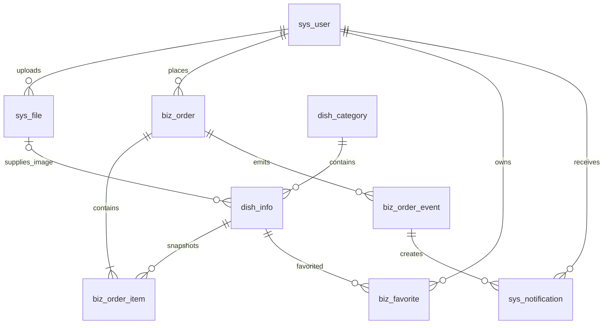

# 陈哥厨房数据库单一基线

> 生效日期：2026-08-08
> 数据库：PostgreSQL 15+
> 适用前提：项目尚未上线，不迁移或兼容旧数据。

## 1. 基线原则

- 唯一结构来源是 `server/der-kitchen-app/src/main/resources/db/migration/V1__init.sql`。
- 应用通过 Flyway 在启动时迁移数据库；Docker Compose 只启动 PostgreSQL，不再挂载 SQL 到 `/docker-entrypoint-initdb.d`。
- 旧 V1 → V2 → V3 补丁链已废弃，不允许再执行旧脚本或从旧表名继续演进。
- 当前主键统一为 PostgreSQL `BIGINT GENERATED BY DEFAULT AS IDENTITY`，Java 实体统一使用 MyBatis-Plus `IdType.AUTO`。
- 所有业务表统一使用 `create_time`、`update_time`、`create_by`、`update_by`、`deleted` 字段。

## 2. 最终表与关系

| 表 | 职责 | 主要关系 |
|---|---|---|
| `sys_user` | 微信用户与管理端账号 | 订单、收藏、文件上传人 |
| `sys_file` | MinIO 对象元数据 | 上传人 → `sys_user` |
| `dish_category` | 菜品分类 | 菜品所属分类 |
| `dish_info` | 菜品信息 | 分类、必选图片文件 |
| `biz_order` | 订单主表 | 下单用户 |
| `biz_order_item` | 订单菜品快照 | 订单、原菜品 |
| `biz_order_event` | 订单领域事件 | 订单、操作者 |
| `sys_notification` | 站内通知与微信投递记录 | 事件、订单、接收人 |
| `biz_favorite` | 用户收藏 | 用户、菜品 |



## 3. 关键约束

- 用户角色限定为 `user/admin`，状态限定为 `active/disabled`；OpenID 和用户名在未删除数据中分别唯一。
- 菜品分类名称和菜品名称在未删除数据中唯一；分类、菜品状态和订单状态由 CHECK 约束限制为代码枚举值。
- 订单口味标签必须是最多 10 项的 JSON 数组；订单菜品快照名称非空，数量限定为 1～20。
- 订单写操作以 `biz_order` 主记录行锁为并发边界，取消、加菜和状态迁移必须先锁主单再修改。
- 菜品只保存 `image_file_id`，接口响应时动态生成 MinIO 访问地址，不保存会过期的预签名 URL。
- `taste_tags` 使用 JSONB 数组，Java 侧通过专用类型处理器按 PostgreSQL JSONB 类型读写。
- 数量、文件大小和烹饪时长具有非负/正数约束。
- 收藏使用 `WHERE deleted = FALSE` 的部分唯一索引，允许逻辑删除后再次收藏同一菜品。
- 订单事件类型、通知渠道和投递状态均受 CHECK 约束；同一事件、接收人和渠道只能生成一条通知。

## 4. 初始数据

V1 会创建两个私有项目初始用户和五个默认分类。账号值由 Flyway placeholders 注入：

| 环境变量 | 用途 |
|---|---|
| `ADMIN_OPENID` | 管理员微信 OpenID |
| `ADMIN_USERNAME` | 管理端用户名 |
| `ADMIN_PASSWORD_HASH` | 管理端 BCrypt 密码哈希，禁止填写明文 |
| `WIFE_OPENID` | 普通用户微信 OpenID |

开发环境默认账号为 `admin / Abc@1234`，V1 接收的是对应 BCrypt 哈希而不是明文；生产配置要求显式提供新的 `ADMIN_PASSWORD_HASH`，不得沿用开发密码。

审计字段由 MyBatis-Plus `AutoFillHandler` 维护，不创建 PostgreSQL 更新时间触发器。登录时把账号用户名写入 Sa-Token Session，`create_by/update_by` 记录该用户名；微信用户没有账号用户名时使用昵称，后台任务使用 `system`。绕过 MyBatis-Plus 的少量 `JdbcTemplate` 更新必须在 SQL 中显式维护 `update_time/update_by`。

## 5. 本地重建

旧数据库结构与该基线不兼容。已有本地 Docker 数据卷时，应先确认其中没有需要保留的数据，再删除旧卷并重新启动 PostgreSQL；随后启动应用，由 Flyway 自动执行 V1。不要把迁移目录重新挂载到 PostgreSQL 初始化目录。

## 6. 验证

项目包含两层验证：

- `DatabaseBaselineSourceTest`：保证迁移目录只有一个 V1，并且只包含最终表名。
- `DatabaseBaselineIntegrationTest`：通过 Testcontainers 在空 PostgreSQL 15 中执行 Flyway，并连接真实 MinIO，验证九张业务表、Mapper 自增主键、JSONB、fileId 图片链路、收藏幂等、对象上传删除、订单事件通知、微信重试和统计口径。

```bash
cd server
mvn clean test
```

没有 Docker 环境时，集成测试会跳过；CI 和交付验收环境必须启用 Docker，确保该测试实际执行。

## 7. 后续迁移规则

在项目首次部署前仍可直接修订 V1 并重建空库。首次部署后不得修改已执行的 V1；之后的结构变化必须新增 V2、V3 等前向迁移。
